# restream-tiktokstudio-unified-chat

**One chat feed for TikTok, Twitch, YouTube and Kick.** Messages land in SQLite,
render in a Next.js dashboard, and can be dropped straight into OBS as a
transparent overlay.

*[Léeme en español →](README.es.md)*

---

<p align="center">
  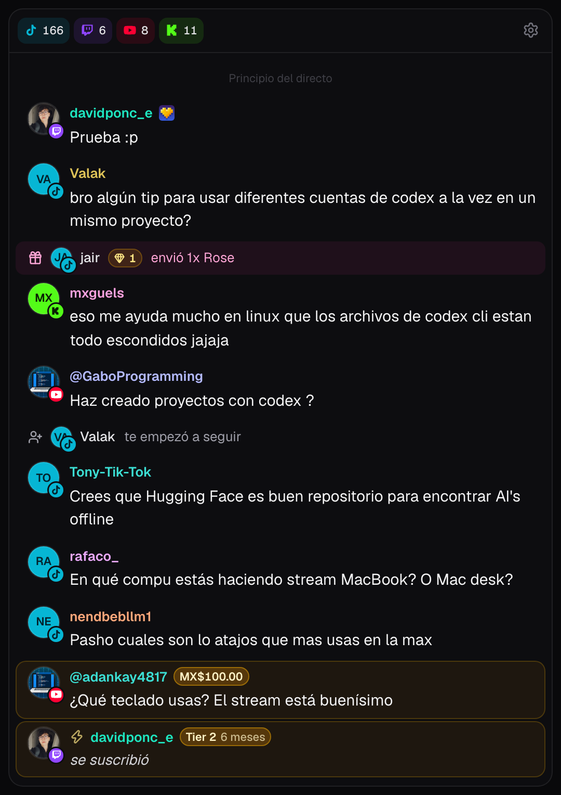
</p>

<p align="center">
  <em>The dashboard. Every message carries its author's avatar with the platform's logo pinned to it.</em>
</p>

---

Streaming to several platforms at once means watching several chats at once.
This pulls all of them into one feed where every message carries its author's
avatar with the platform's logo pinned to it, so you know where it came from
without reading a label.

- **No screenshots, no OCR, no headless browser.** Both sources hand over
  structured JSON with a unique ID per message.
- **TikTok Studio is not required.** The name refers to where your chat normally
  lives — Restream's embed and TikTok Studio's panel. This reads TikTok's LIVE
  WebSocket directly, so the desktop app never has to be open or even installed.
- **No TikTok credentials.** Just your `@handle`.
- **One process.** The collectors start with the Next.js server.
- **Nothing is lost on reconnect.** Deduplication is a unique index in SQLite,
  not a heuristic.

## Requirements

- Node.js 22 or newer — the Restream collector uses the built-in `WebSocket`
- A [Restream](https://restream.io) account for Twitch, YouTube and Kick
- A TikTok account that streams live

TikTok and Restream are independent. Set up one, both, or neither — whatever is
missing is simply disabled, and the header tells you which.

## Setup

```bash
git clone https://github.com/<you>/restream-tiktokstudio-unified-chat
cd restream-tiktokstudio-unified-chat
npm install
cp .env.example .env
```

Fill in `.env`:

```ini
# From https://chat.restream.io — the embed URL is
#   https://chat.restream.io/embed?token=YOUR-TOKEN-HERE
RESTREAM_CHAT_TOKEN=your-token-here

# Your TikTok handle, no leading @
TIKTOK_USERNAME=yourhandle
```

Then:

```bash
npm run dev
```

Open <http://localhost:7637>. That is the whole setup — there is no second
process to start.

Once it is running you can change both values from the **gear icon** in the
header without touching `.env` or restarting anything.

## The dashboard

Each row is an avatar with the platform's logo pinned to its corner, the
author's name, their badges, and the message. Usernames get a stable color
derived from their ID, so regulars become recognizable at a glance. Twitch users
who picked their own color keep it.

The platform buttons in the header double as filters and as connection status —
a green dot means connected, amber means reconnecting, red means something
broke. Click one to hide that platform.

Likes and joins from the same person collapse into a single row within a
30-second window. TikTok sends likes in bursts, and without this they bury the
conversation.

### View filters

Under the gear icon:

| Toggle | Default | What it does |
|---|---|---|
| Messages only | off | Hides likes, gifts, follows, shares and joins |
| Joins | off | Announces when someone enters the live |
| Bot messages | on | Streamlabs, Nightbot and friends |

These are stored in `localStorage`. They are per-browser display preferences and
apply instantly, unlike the token and handle which change the collector's
sockets and live in SQLite.

## A message as a video card

A stream short usually opens on the question the streamer answers, and that question is a
message in this chat. `?card=<id>` draws one message as a card sized for a vertical canvas:
1000px wide at scale 1, near-opaque, transparent around it, with the avatar embedded so the
picture outlives TikTok's expiring links.

```bash
npm run shot -- --card 1442                 # → /tmp/card-1442.png, alpha channel
npm run shot -- --card 1442 --out card.png
```

<p align="center">
  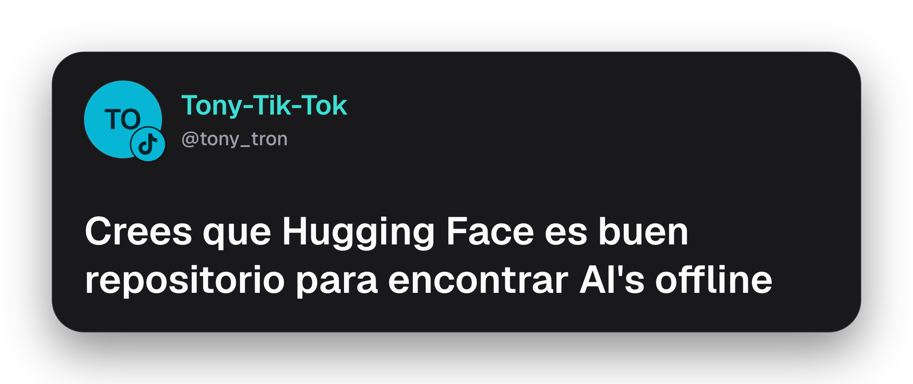
</p>

The clapperboard that appears next to a message's time in the dashboard opens the same view
in a tab, which is how you find the id. `?scale=` resizes the whole card; the id is the
row's own, so a video editor that reads `chat.db` can ask for the same message.

## Money

Super Chats, subs, bits, gifted subs and TikTok gifts carry their value into the
feed and the overlay.

| Platform | What arrives | What you see |
|---|---|---|
| YouTube | Super Chat amount and currency | the platform's own figure, `MX$100.00` |
| Twitch | bits, sub tier, months, gifted count | `2,000 bits`, `Tier 2 · 6 months` |
| Kick | sub months and gifted count | `Sub · ×5 gifted` |
| TikTok | diamonds of the whole combo | `5,000` with a gem |

**Only YouTube exposes actual money.** A Twitch or Kick sub carries a tier, not a
price — the dollar figure behind `Tier 2` is the platform's list price, not
something the API said. Bits and diamonds convert at their published rate.

The amount shown is always the one the platform sent, never a conversion of
ours. Rates are used for one thing only: deciding how much a row stands out.
Four levels, one color — gold, and gold means money here and nothing else:

| Level | Roughly | How it renders |
|---|---|---|
| 0 | under $2 | the usual compact strip, with a small pill |
| 1 | $2–$10 | a card with a gold ring |
| 2 | $10–$50 | brighter ring |
| 3 | $50+ | brightest ring, solid pill |

Level 0 has no pill in the overlay. A one-diamond rose does not deserve the same
gold tag as a thousand-peso Super Chat on your viewers' screens — you still see
it in the dashboard, which is yours.

### Gallery

Each kind of message, alone, as your viewers see it in the overlay and as you
see it in the dashboard. Regenerate with `npm run shot -- --gallery`.

| | Overlay | Dashboard |
|---|---|---|
| Chat | 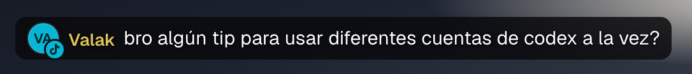 | 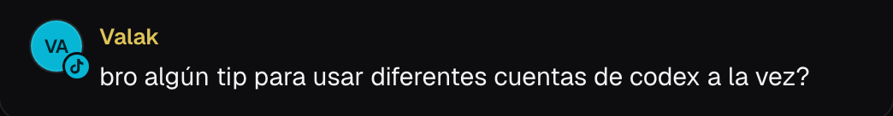 |
| Chat with badges | 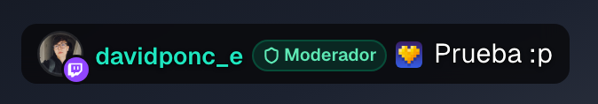 | 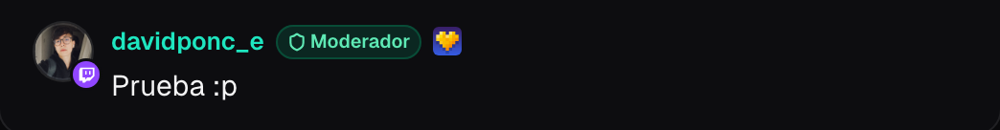 |
| Follow | 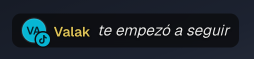 | 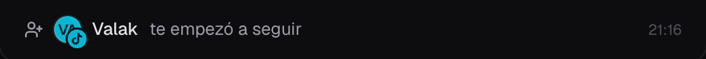 |
| Raid | 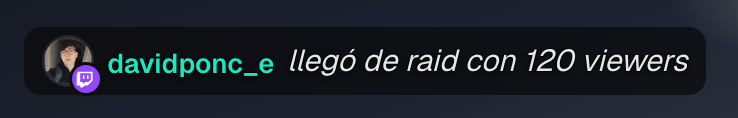 | 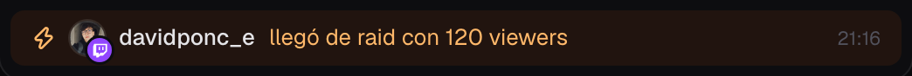 |
| Gift · level 0 | 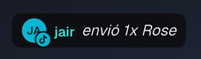 | 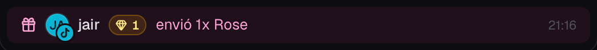 |
| Super Chat · level 1 | 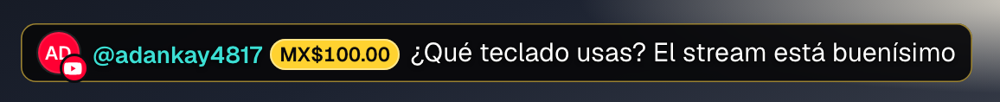 | 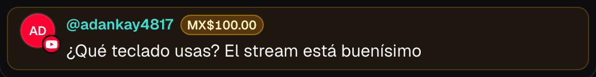 |
| Sub · level 1 | 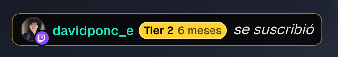 | 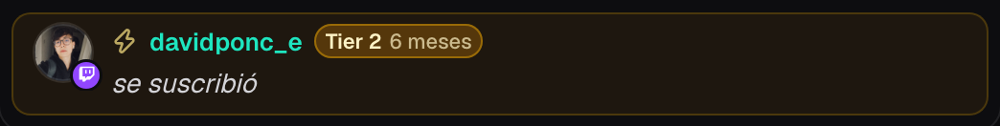 |
| Bits · level 2 | 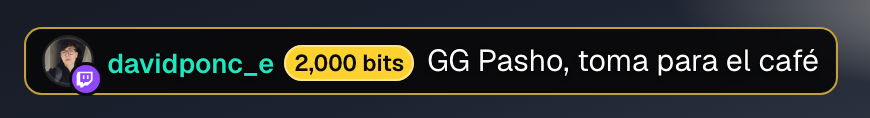 | 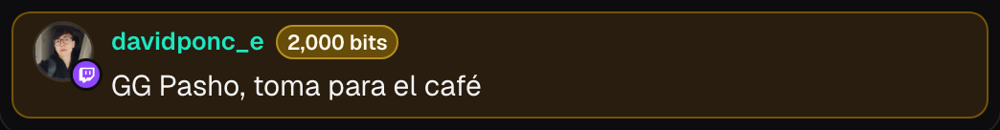 |
| Gifted subs · level 2 | 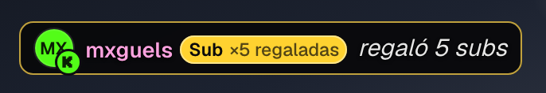 | 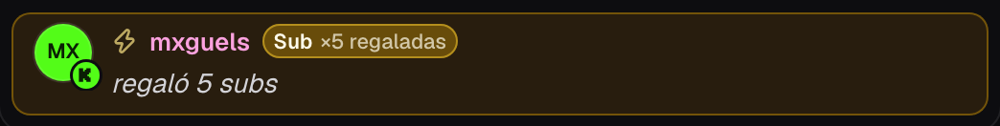 |
| Diamonds · level 2 | 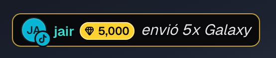 | 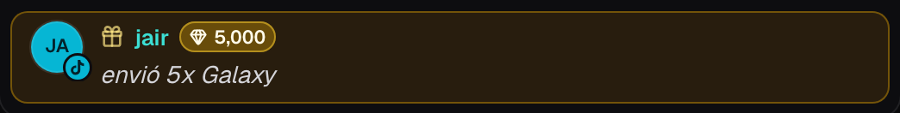 |
| Super Chat · level 3 | 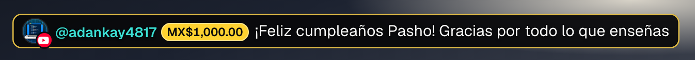 | 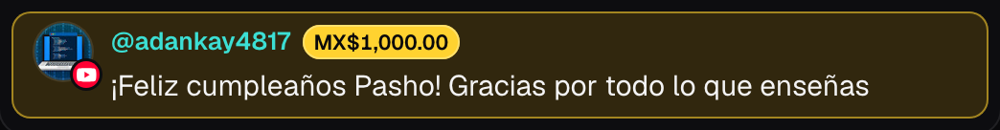 |

### When an amount does not show up

Restream's embed WebSocket is undocumented, so the collector looks for the
*names* of the money fields (`amount`, `amountMicros`, `formattedAmount`,
`bits`, `tier`…) anywhere in the payload instead of reading fixed paths. When it
finds nothing, the event is still stored with its raw payload in `meta.raw`, and
any `eventTypeId` that is not mapped yet gets logged once with a sample. Nothing
is silently dropped:

```bash
# event types that arrived without a mapping
sqlite3 data/chat.db "SELECT json_extract(meta,'\$.rawType'), COUNT(*) FROM events
  WHERE meta LIKE '%rawType%' GROUP BY 1"

# the raw payloads, to find out what the amount field is called
sqlite3 data/chat.db "SELECT platform, json_extract(meta,'\$.raw') FROM events
  WHERE meta LIKE '%raw%' ORDER BY id DESC LIMIT 20"
```

`CHAT_RAW=1` keeps the raw payload of *every* event, chat included. Useful for
one stream when you are hunting a field; wasteful as a permanent setting.

## OBS overlay

Add `?stream` to the URL and the page becomes a transparent, chrome-free overlay
anchored to the bottom of the screen:

```
http://localhost:7637/?stream
```

<p align="center">
  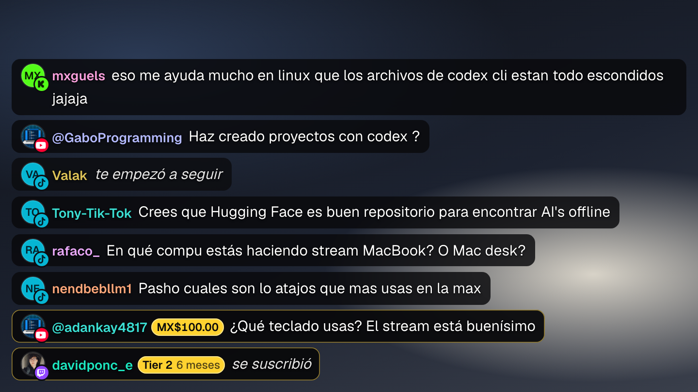
</p>

In **OBS**: add a *Browser* source, paste that URL, and check *Shutdown source
when not visible*. No custom CSS needed — the page already renders with an alpha
channel. TikTok Studio works the same way with its browser source.

Each message sits on a near-opaque pill with a dark stroke around the letters.
Neither is decoration. A *translucent* black pill separates nothing when what is
behind it is already dark — screen-sharing an editor or a docs page is exactly
that case, and the chat ends up competing with the text underneath. The letter
stroke is the backup: even if a scene defeats the pill, the glyphs keep their own
edge.

If the chat still gets lost against your scene, raise the opacity:

```
http://localhost:7637/?stream&opacity=0.95
```

### Parameters

| Parameter | Default | What it does |
|---|---|---|
| `ttl` | `0` | Seconds before a message fades out. `0` keeps them |
| `max` | `12` | How many messages are visible at once (1–60) |
| `scale` | `1.1` | Text scale (0.5–3), to match your scene resolution |
| `opacity` | `0.82` | Background opacity behind each message (0–1) |
| `outline` | on | Dark stroke around the letters |
| `events` | on | Gifts, follows, subs, raids and shares |
| `likes` | **off** | Likes |
| `bots` | **off** | Streamlabs and similar |

Booleans accept `?likes`, `?likes=1` or `?likes=true` to enable; `=0`, `=false`
or `=no` to disable. Joins never appear in the overlay.

```
# clears itself after a minute of silence, larger text
http://localhost:7637/?stream&ttl=60&scale=1.3

# messages and nothing else
http://localhost:7637/?stream&events=0
```

Likes are off by default for a reason: on a busy stream they arrive every second
and your viewers would see nothing but "sent 15 likes".

## How the data gets in

| Source | Mechanism | Credentials |
|---|---|---|
| TikTok | LIVE WebSocket via [`tiktok-live-connector`](https://github.com/isaackogan/TikTokLive) | none — just the `@handle` |
| Twitch · YouTube · Kick | `wss://backend.chat.restream.io/ws/embed` | the embed token |

The Restream embed is a web page, but its WebSocket URL is built from the same
token the embed uses, so no browser is involved.

TikTok's WebSocket needs a signed handshake, which
[`tiktok-live-connector`](https://github.com/isaackogan/TikTokLive) obtains from
Euler Stream's free tier. One signature per connection, not per message, so a
multi-hour stream costs a single request. The collector uses exponential backoff
precisely so a reconnect loop cannot burn through that quota.

**This is reverse engineering, not an official API.** TikTok can break it at any
time. For a personal dashboard that is a reasonable trade; for anything load
bearing, it is not.

## Architecture

```
instrumentation.ts        starts the collectors when the server boots
src/server/
  collector.ts            orchestrates, validates config, restarts in place
  tiktok.ts               chat, gifts, likes, follows, shares, joins, viewers
  restream.ts             the other three platforms
  db.ts                   schema, writes, deduplication
  settings.ts             token and handle, with .env as the initial value
  status.ts               connection state the UI reads
src/app/api/stream/       SSE — history on connect, then only what is new
src/app/api/settings/     reads and writes settings; saving reconnects
src/app/api/status/       connection state as JSON
src/components/chat/      message row, avatar with platform chip, badges, overlay
src/lib/                  types, readonly reads, user colors, collapsing, view prefs
```

Three decisions worth knowing before you change anything:

**Deduplication belongs to the database.** The unique index on
`(platform, external_id)` means a collector can crash, reconnect and replay
without duplicating a single row. Restream's key is `payload.eventIdentifier` —
**not** `payload.eventId`, which looks like a per-message UUID but is constant
for the whole session and even repeats across platforms. Using the wrong one
silently drops every message after the first.

**The collectors must start exactly once.** The guard in `collector.ts` lives on
`globalThis` rather than in module scope, because dev hot-reload re-evaluates
modules and would open a fresh socket on every save — which on TikTok also burns
a signature each time.

**A dead socket does not always close.** A half-open TCP connection stays
"connected" while delivering nothing. Restream sends a heartbeat every few
seconds, so the collector treats 45 seconds of total silence as death and
reconnects.

## Configuration reference

| Variable | Required | Default |
|---|---|---|
| `RESTREAM_CHAT_TOKEN` | for Twitch/YouTube/Kick | — |
| `TIKTOK_USERNAME` | for TikTok | — |
| `CHAT_DB_PATH` | no | `./data/chat.db` |
| `CHAT_RAW` | no | off — `1` stores every raw payload |

`.env` provides the initial values. Anything saved from the gear icon is stored
in SQLite and takes precedence — the file is never rewritten, because Next.js
watches it in dev and would restart the server mid-reconfiguration.

## Running in production

```bash
npm run build
npm start
```

`next start` serves on **port 7637**, the same as `npm run dev`. The collectors
start here too — `instrumentation.ts` runs on `next start`, not just in dev — so
production behaves exactly like development: one process, nothing else to launch.

To use a different port, pass it through:

```bash
npm run dev -- -p 3000
npm start -- -p 3000
```

Keep in mind this is a **long-lived stateful server**, not a request/response app.
It holds open WebSockets and writes to a local SQLite file, so it does not fit
serverless platforms. Run it on a machine that stays up: your own box, a VPS, or
a container with a persistent volume mounted at `data/`.

Because SQLite is a local file, `data/chat.db` is the whole database. Back it up
by copying it — but copy `chat.db-wal` alongside it, or use
`sqlite3 data/chat.db ".backup backup.db"` to get a consistent snapshot while the
collectors are writing.

### As a background service (macOS)

`scripts/service.sh` installs the chat as a launchd agent: a plain `node`
process that starts at login, restarts itself if it dies, and survives closing
the terminal.

```bash
./scripts/service.sh install    # build, copy, load the agent
./scripts/service.sh update     # rebuild after code changes
./scripts/service.sh status     # state, pid, HTTP check
./scripts/service.sh logs       # tail stdout and stderr
./scripts/service.sh stop       # stop and stay stopped
./scripts/service.sh uninstall  # remove the agent
```

It builds with `output: 'standalone'` and copies the result out of the repo to
`~/.local/share/unified-live-chat`, so the running process is
`node .../start.js` rather than the Next.js CLI. That matters more than it
sounds: the process is also renamed to `unified-live-chat`, which keeps it out
of the blast radius of tooling that sweeps dev servers with `pkill -f next` or
by killing whatever holds a port. Settings live in SQLite, so no secrets end up
in the plist.

Run the service **or** `npm run dev`, never both: they bind the same port on
different interfaces and you end up with two sets of collectors on one database,
opening duplicate TikTok connections. `install` and `start` refuse to run if the
port is already taken; `update` does not, since it restarts the service in place.

One caveat worth knowing if you change the build: the standalone bundle does not
include `.next/server/instrumentation.js`, and Next.js loads that file inside a
`try/catch` that swallows `MODULE_NOT_FOUND`. Miss it and the app serves pages
perfectly with no collectors and no error anywhere. `service.sh` copies the hook
and its traced dependencies after every build for exactly this reason.

## Development

```bash
npm run dev        # server + collectors on http://localhost:7637
npm test           # node --test tests/
npm run typecheck  # tsc --noEmit
npm run lint       # eslint
npm run build      # production build

npm run shot -- '/?stream' --on-video   # screenshot the overlay over a mock scene
npm run shot -- --readme                # regenerate both images in docs/
npm run shot -- --gallery               # one crop per message kind, into docs/messages/
npm run shot -- --card 1442 --out docs/card.png   # one message as a video card
```

The README images are rendered from `docs/fixture.json` — a fixed set of real
messages — rather than from whatever is in chat at that moment, so they stay
reproducible and actually show the app doing its job instead of a random
twenty-second slice full of likes. The script shoots whatever is listening on
`:7637`; if that is the launchd service, it serves the *built* bundle, so after
touching the UI either rebuild it or point the script at a dev server:

```bash
APP_URL=http://localhost:7638 npm run shot -- --readme
```

The database is a plain SQLite file, so you can query it directly:

```bash
sqlite3 data/chat.db "SELECT platform, type, COUNT(*) FROM events GROUP BY 1, 2"
```

## Roadmap

- Claude inference: rolling chat summary, unanswered questions, clip-worthy moments
- Remote deployment
- Moderation actions from the dashboard

## License

MIT — see [LICENSE](LICENSE).

This project is not affiliated with TikTok, Twitch, YouTube, Kick or Restream.
The TikTok integration relies on an unofficial reverse-engineered library; check
the terms of service of each platform before deploying this anywhere public.
